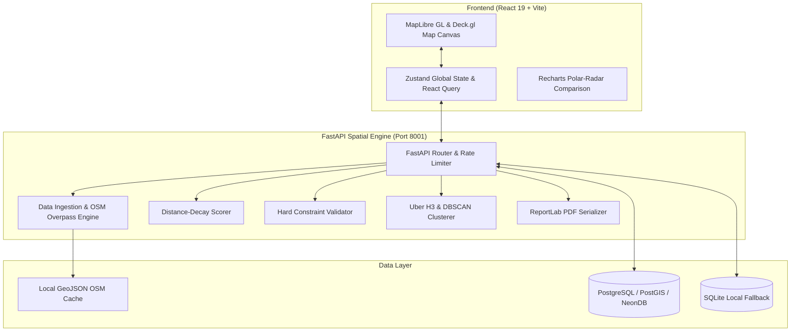

# SiteIQ 🗺️ — Enterprise AI Spatial Site Readiness & Location Intelligence Platform

[](https://www.python.org/)
[](https://fastapi.tiangolo.com/)
[](https://react.dev/)
[](https://vitejs.dev/)
[](https://maplibre.org/)
[](https://h3geo.org/)
[](LICENSE)

An advanced, full-stack **Spatial Econometric Location Intelligence Platform** for commercial real estate, retail expansion, and urban infrastructure site selection. **SiteIQ** combines a high-performance **FastAPI** backend scoring engine with an interactive **React 19 / MapLibre GL / Deck.gl** vector frontend.

---

## 🌟 Key Features & Highlights

- 📍 **Real-Time Interactive Site Readiness Index (0–100)**  
  Click anywhere on the interactive vector map to compute a comprehensive site readiness score ($A$ through $F$ grade) using dynamic 5-layer spatial econometric models.

- 🔷 **Uber H3 Hexagonal Spatial Indexing & DBSCAN Clustering**  
  Integrates **Uber H3** discrete global grid system (Resolution 8/9) with **Scikit-Learn DBSCAN** clustering to discover high-potential commercial hotspots and spatial density clusters.

- 🚗 **Isochrone Catchment & Drive-Time Analysis**  
  Computes reachable catchment boundaries for 5, 10, and 15-minute intervals across driving, walking, and cycling modes using OpenRouteService with geometric fallback algorithms.

- 📊 **Multi-Site Comparison Radar Engine**  
  Pin multiple candidate coordinates to compare demographics, transportation access, competition density, land-use zoning, and environmental risk side-by-side using dynamic **Recharts Polar Radar** visualization.

- 📄 **Automated Executive PDF Brief Generator**  
  Serialize spatial analysis metrics, breakdown charts, threshold warnings, and location grades into professional downloadable PDF site selection reports powered by **ReportLab**.

- 🔐 **Dual-Mode Enterprise Data Layer (Cloud + Offline)**  
  Features an adaptive database engine supporting **PostgreSQL / PostGIS / NeonDB Cloud** for production pooling, alongside a zero-config embedded **SQLite fallback** for standalone offline execution.

---

## 🏗️ System Architecture



---

## 🛠️ Technology Stack

| Layer | Technologies Used |
| :--- | :--- |
| **Frontend Framework** | React 19, TypeScript, Vite 8, React Router v6 |
| **Mapping & Geospatial** | MapLibre GL JS, Deck.gl v9, H3-js, Mapbox Draw |
| **State & Data Fetching**| Zustand, TanStack React Query v5 |
| **UI & Visualization** | TailwindCSS, Recharts (Radar/Bar), Lucide React, Clsx |
| **Backend Framework** | Python 3.12+, FastAPI, Uvicorn, Pydantic v2 |
| **Spatial Econometrics** | GeoPandas, Shapely, PyOGRIO, Rasterio, PyProj, Uber H3, Scikit-Learn |
| **PDF & Auth Storage** | ReportLab 5.0, Asyncpg, Psycopg2, SQLite3, Python-Jose JWT, Bcrypt |

---

## 📐 Spatial Econometric Scoring Methodology

The Site Readiness Index ($S$) evaluates candidate coordinates ($x, y$) across **5 weighted spatial layers** calibrated for dense urban markets:

$$\text{Composite Score} = \sum_{i=1}^{n} w_i \cdot L_i(x, y) + \text{Threshold Bonuses}$$

| Layer ($L_i$) | Weight ($w_i$) | Indicators & Spatial Evaluation |
| :--- | :---: | :--- |
| **Demographics** | `0.30` | Population density within 5km catchment, purchasing power & income distribution. |
| **Transportation** | `0.25` | Proximity to primary highways, metro/BRTS transit stops, and arterial road networks. |
| **Competition** | `0.20` | Non-linear market saturation curve evaluating competitor POIs within 1km radius. |
| **Land Use / Zoning** | `0.15` | Permitted commercial zoning codes (`C1`, `C2`, `MX`, `TC`) vs residential/industrial restrictions. |
| **Environment** | `0.10` | Flood risk zone disqualifiers (`AE`, `VE`), air quality index (AQI), and noise exposure. |

### Distance-Decay Function
Proximity values use an exponential distance-decay model:
$$S(d) = S_0 \cdot e^{-\lambda d}$$
where $d$ is distance in kilometers and $\lambda$ represents feature-specific decay rates ($\lambda_{\text{highway}} = 0.6$, $\lambda_{\text{transit}} = 0.4$, $\lambda_{\text{flood}} = 1.2$).

---

## 🚀 Quick Start & Installation

### Prerequisites
- **Node.js** v18+ or v20+
- **Python** 3.10+ (Python 3.12/3.14 recommended)

### 1. One-Click Launcher (Windows)
Run `start.bat` to automatically install requirements, boot the FastAPI backend, launch the Vite dev server, and open your browser:
```cmd
start.bat
```

### 2. Manual Installation & Development

#### Backend Setup
```bash
# Navigate to main directory
cd SiteIQ-main

# Install dependencies
pip install -r requirements.txt

# Start FastAPI Server (Port 8001)
python -m uvicorn main:app --host 127.0.0.1 --port 8001 --reload
```

#### Frontend Setup
```bash
# Navigate to frontend directory
cd frontend

# Install node dependencies
npm install

# Launch Vite Dev Server (Port 5173)
npm run dev
```

Open your browser to **`http://localhost:5173`**.

---

## 🐳 Deployment via Docker Compose

Run the application with PostgreSQL/PostGIS and FastAPI in containerized environments:

```bash
docker-compose up -d --build
```

- **API Gateway**: `http://localhost:8000`
- **PostGIS Container**: `localhost:5432`

---

## 🔌 REST API Reference

| Method | Endpoint | Description |
| :---: | :--- | :--- |
| `POST` | `/score` | Compute site readiness score, layer scores, grade & recommendations for (lat, lon). |
| `POST` | `/batch-score` | Compute site scores for a batch array of candidate locations. |
| `GET` | `/isochrone` | Compute travel-time catchment polygon (driving/walking/cycling). |
| `GET` | `/hotspots` | Generate Uber H3 hexagonal spatial aggregation clusters. |
| `POST` | `/export-pdf` | Generate binary PDF site brief report. |
| `POST` | `/auth/signup` | Register user account with bcrypt password hashing. |
| `POST` | `/auth/login` | Authenticate user and return JWT bearer token. |
| `GET` | `/admin/users` | Retrieve registered user activity and signup analytics. |
| `GET` | `/stats` | System health check, dataset feature counts, and layer status. |

---

## 📂 Repository Structure

```
SiteIQ/
├── main.py                   # FastAPI production server & route handlers
├── auth.py                   # Auth, JWT, PostgreSQL & SQLite fallback database engine
├── config.py                 # Econometric layer weights & distance-decay parameters
├── requirements.txt          # Python dependencies
├── start.bat                 # Windows one-click startup script
├── docker-compose.yml        # Docker orchestration manifest
├── engine/                   # Spatial Econometric Core
│   ├── data_ingestion.py     # OSM Overpass fetcher & GeoJSON layer loader
│   ├── scorer.py             # Multi-layer score calculation engine
│   ├── spatial_analysis.py   # Uber H3 indexing & DBSCAN clustering
│   ├── distance_decay.py     # Exponential distance-decay modeling
│   ├── hard_constraints.py   # Disqualifier & zoning validation
│   └── isochrone.py          # Travel catchment calculations
├── data/                     # Spatial GeoJSON datasets (Demographics, Roads, POIs, Zoning, Risk)
└── frontend/                 # React 19 Frontend App
    ├── src/
    │   ├── components/       # Map, Sidebar, Report & Chart components
    │   ├── pages/            # Map Analysis, Dashboard, Login, Signup pages
    │   ├── context/          # Auth Context provider
    │   └── store/            # Zustand global state store
    └── package.json          # Frontend dependencies & Vite configuration
```

---

## 👤 Author

**Swayam**  
- GitHub: [@Swayam0507](https://github.com/Swayam0507)  
- Repository: [https://github.com/Swayam0507/SiteIQ](https://github.com/Swayam0507/SiteIQ)

---

## 📜 License

This project is licensed under the **MIT License** — see the [LICENSE](LICENSE) file for details.
